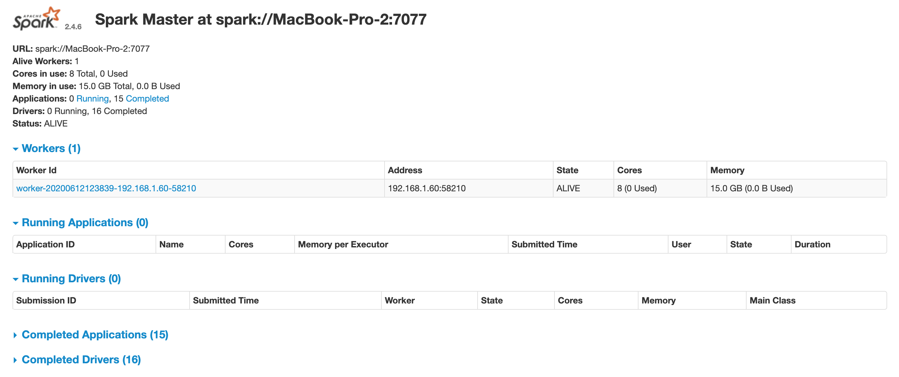
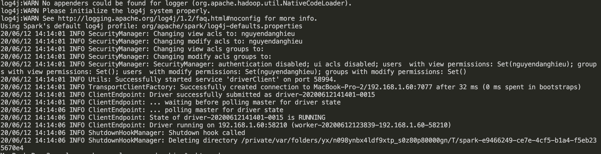
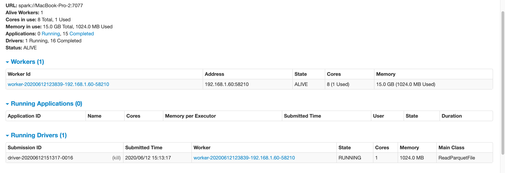
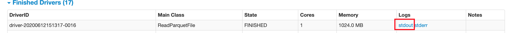
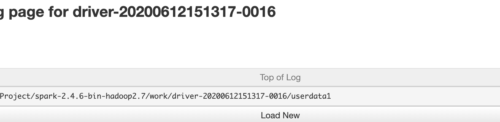
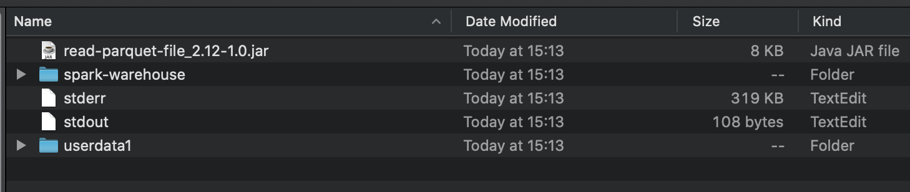

# scala-spark-example
This is simple code for compute data from parquet file
## How To Run (Step by step)
1. Install `Scala` and `Spark` ([Mac](https://medium.com/beeranddiapers/installing-apache-spark-on-mac-os-ce416007d79f)/[Linux](https://phoenixnap.com/kb/install-spark-on-ubuntu)).
2. Clone this repository.
3. cd `scala-spark-example`
4. Start spark by `spark shell`
5. Type `:load ReadParquetFile.scala` for import and define object   
6. Type `ReadParquetFile.main(Array("URL"))` with URL is path to parquet file
## Result
I push my result to folder `userdata` has numbered 1 to 5
## How to run with spark-submit on local
1. Dowload Spark: https://downloads.apache.org/spark/spark-2.4.5/spark-2.4.5-bin-hadoop2.7.tgz and unpack folder
2. Install JDK8 (required)
3. cd `path/to/spark-2.4.5-bin-hadoop2.7/sbin` and run `./start-master.sh` and copy URL master
4. Run `./start-slave.sh <URL master>`
5. Access `localhost::8080` for manage

6. cd `to current project` and run `spark-submit  --master <URL master> --deploy-mode cluster  --class "ReadParquetFile" <path to jar file> <"path to parquet file">`

On URL master

7. Click to DriverID and click `stdout` to check where result has been stored 

## How to run with spark-submit on Yarn node cluster
